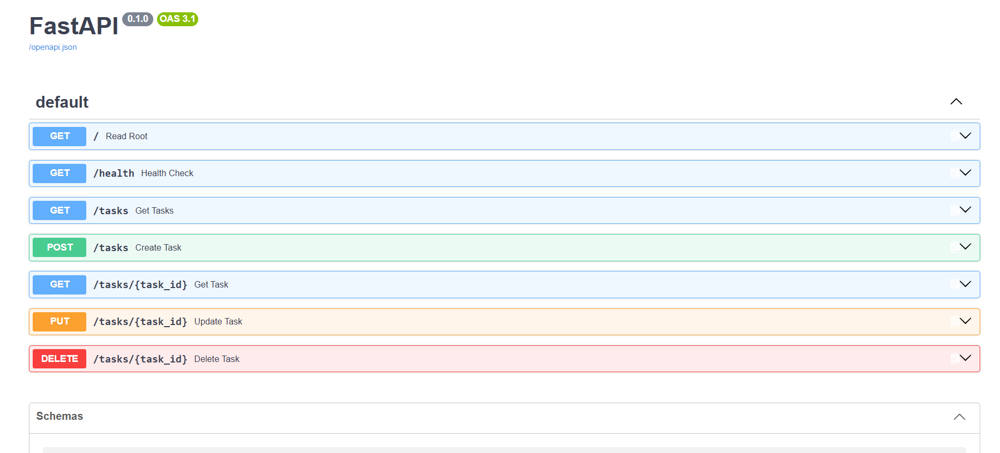

# Task API

A small CRUD API for managing a to-do list, built with FastAPI. Supports creating, reading, updating, and deleting tasks — stored in memory (data resets when the server restarts).

## How to run

1. Clone this repo
2. Create a virtual environment: `python -m venv venv`
3. Activate it: `venv\Scripts\activate` (Windows) or `source venv/bin/activate` (Mac/Linux)
4. Install dependencies: `pip install fastapi uvicorn`
5. Start the server: `uvicorn main:app --reload`
6. Visit `http://localhost:8000`

## Endpoints

| Method | Path          | Description           |
|--------|---------------|------------------------|
| GET    | /             | API info               |
| GET    | /health       | Health check            |
| GET    | /tasks        | List all tasks          |
| GET    | /tasks/{id}   | Get one task             |
| POST   | /tasks        | Create a task            |
| PUT    | /tasks/{id}   | Update a task             |
| DELETE | /tasks/{id}   | Delete a task              |

## Example request

\`\`\`
curl.exe -i -X POST http://localhost:8000/tasks -H "Content-Type: application/json" -d "@task.json"

HTTP/1.1 201 Created
content-type: application/json

{"id":4,"title":"Buy milk","done":false}
\`\`\`

## Swagger UI

Interactive docs available at `http://localhost:8000/docs`.

!