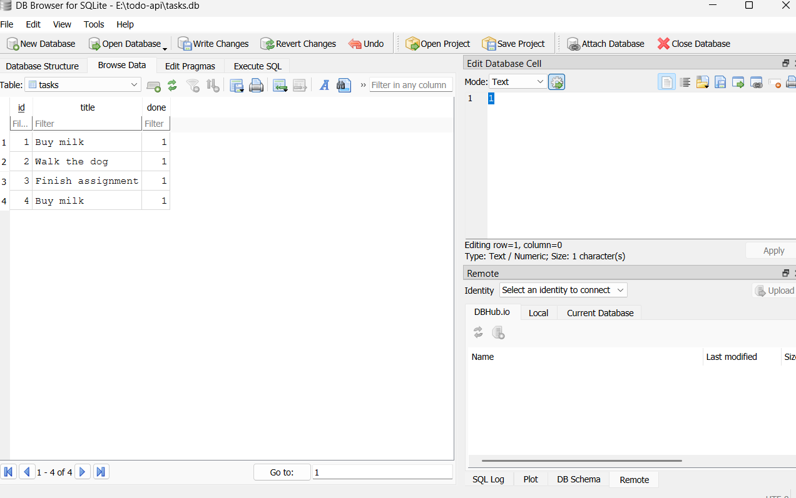
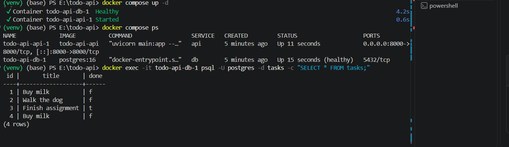

# Task API

A small CRUD API for managing a to-do list, built with FastAPI. Supports creating, reading, updating, and deleting tasks — stored in memory (data resets when the server restarts).

## How to run

1. Clone this repo
2. Create a virtual environment: `python -m venv venv`
3. Activate it: `venv\Scripts\activate` (Windows) or `source venv/bin/activate` (Mac/Linux)
4. Install dependencies: `pip install fastapi uvicorn`
5. Start the server: `uvicorn main:app --reload`
6. Visit `http://localhost:8000`

## Endpoints

| Method | Path          | Description           |
|--------|---------------|------------------------|
| GET    | /             | API info               |
| GET    | /health       | Health check            |
| GET    | /tasks        | List all tasks          |
| GET    | /tasks/{id}   | Get one task             |
| POST   | /tasks        | Create a task            |
| PUT    | /tasks/{id}   | Update a task             |
| DELETE | /tasks/{id}   | Delete a task              |

## Example request

\`\`\`
curl.exe -i -X POST http://localhost:8000/tasks -H "Content-Type: application/json" -d "@task.json"

HTTP/1.1 201 Created
content-type: application/json

{"id":4,"title":"Buy milk","done":false}
\`\`\`

## Swagger UI

Interactive docs available at `http://localhost:8000/docs`.

!

# Task API

A CRUD API for managing a to-do list, built with FastAPI and backed by a real SQLite database. Data now survives server restarts.

## Why SQLite

SQLite needs no separate server or installation — the whole database is a single file (`tasks.db`) that's created automatically the first time the app runs. It's the simplest way to learn real SQL and persistence before moving to a bigger database like PostgreSQL later.

## How to run

1. Clone this repo
2. Create a virtual environment: `python -m venv venv`
3. Activate it: `venv\Scripts\activate` (Windows) or `source venv/bin/activate` (Mac/Linux)
4. Install dependencies: `pip install fastapi uvicorn`
5. Start the server: `uvicorn main:app --reload`
6. Visit `http://localhost:8000`

The database file `tasks.db` is created automatically on first run, with 3 example tasks seeded.

## Endpoints

| Method | Path          | Description           |
|--------|---------------|------------------------|
| GET    | /             | API info               |
| GET    | /health       | Health check            |
| GET    | /tasks        | List all tasks          |
| GET    | /tasks/{id}   | Get one task             |
| POST   | /tasks        | Create a task             |
| PUT    | /tasks/{id}   | Update a task              |
| DELETE | /tasks/{id}   | Delete a task               |

## Example request

\`\`\`
curl.exe -i -X POST http://localhost:8000/tasks -H "Content-Type: application/json" -d "@task.json"

HTTP/1.1 201 Created
content-type: application/json

{"id":4,"title":"Buy milk","done":false}
\`\`\`

## Swagger UI

Interactive docs available at `http://localhost:8000/docs`.

## Database

Data is stored in `tasks.db`, a SQLite file created automatically on first run. View it with [DB Browser for SQLite](https://sqlitebrowser.org/).

Example query run manually in DB Browser:
\`\`\`sql
UPDATE tasks SET done = 1;
\`\`\`
Result: all tasks were instantly marked done — and calling `GET /tasks` through the API reflected the change immediately, with no server restart. This proves the API and the database file are always in sync; there's no separate cache to update.

  
# Task API

A CRUD API for managing a to-do list, built with FastAPI and backed by PostgreSQL, fully containerized with Docker. The whole stack (app + database) starts with one command.

## Storage journey

This project has evolved through three storage layers, with the API staying identical the whole way:
1. In-memory list (gone on restart)
2. SQLite file (`tasks.db`)
3. **PostgreSQL in Docker (current)** — a real database server, containerized

## How to run

1. Clone this repo
2. Copy `.env.example` to `.env`
3. Run: `docker compose up`
4. Visit `http://localhost:8000`

That's it — Docker builds your app, starts Postgres, waits for it to be ready, then starts your API. The database table and 3 example tasks are created automatically on first run.

## Environment variables

See `.env.example` for the required `DATABASE_URL` format.

## Endpoints

| Method | Path          | Description           |
|--------|---------------|------------------------|
| GET    | /             | API info               |
| GET    | /health       | Health check            |
| GET    | /tasks        | List all tasks          |
| GET    | /tasks/{id}   | Get one task             |
| POST   | /tasks        | Create a task             |
| PUT    | /tasks/{id}   | Update a task              |
| DELETE | /tasks/{id}   | Delete a task               |

## Example request

\`\`\`
curl.exe -i -X POST http://localhost:8000/tasks -H "Content-Type: application/json" -d "@task.json"

HTTP/1.1 201 Created
content-type: application/json

{"id":4,"title":"Buy milk","done":false}
\`\`\`

## Swagger UI

Interactive docs available at `http://localhost:8000/docs`.

## Database

PostgreSQL 16, running in Docker with a named volume (`taskdata`) for persistence.

**Persistence proof:** created a task, ran `docker compose down` (fully removing both containers), then `docker compose up` again. The task was still present in `GET /tasks` — proving the volume preserves data independent of the containers' lifecycle.

